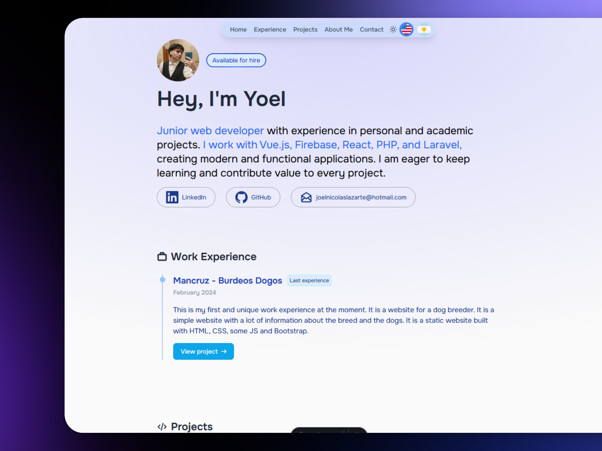

# My Portfolio

Welcome to my portfolio! This project is a showcase of my skills, experience, and the projects I’ve worked on. Built with a focus on modern web development practices, this portfolio highlights my expertise in **Vue.js**, **Laravel**, **TailwindCSS**, and more.

<p align="center">
  
</p>

---

## 🌟 Features

- **Multi-language Support**: Supports English (`en`) and Spanish (`es`) translations, ensuring a broader reach.
- **Dynamic Styling**: Highlights elements using utility classes (e.g., `<strong>` tags styled dynamically for accessibility and design consistency).
- **Responsive Design**: Fully responsive and mobile-friendly, providing a great user experience on all devices.
- **Interactive Components**: Includes interactive UI elements built with modern frameworks like Vue.js.

---

## 📂 Folder Structure

```
.
├── public            # Static assets (e.g., images)
├── src               # Main project source files
│   ├── components    # Reusable UI components and icons
│   ├── styles        # TailwindCSS styles
│   ├── i18n          # Translation files and utilities
│   ├── pages         # Portfolio sections (Experience, Projects, About Me, etc.)
|        └── es       # Main page for Spanish translation
│   └── utils         # Helper functions (e.g., getLangFromUrl, useTranslations)
├── astro.config.js   # Astro configuration file
├── package.json      # Project dependencies and scripts
├── tailwind.config.js# TailwindCSS configuration
└── README.md         # Project documentation
```

---

## 🚀 Tech Stack

- **Framework**: [Astro](https://astro.build/)
- **Frontend**: [TailwindCSS](https://tailwindcss.com/)
- **Localization**: Custom i18n setup
- **Hosting**: [Vercel](https://www.vercel.com/) 

---

## 📄 Setup Instructions

1. **Clone the Repository**:

   ```bash
   git clone https://github.com/YoelLazarte/portfolio.git
   cd portfolio
   ```

2. **Install Dependencies**:

   ```bash
   npm install
   ```

3. **Run the Development Server**:

   ```bash
   npm run dev
   ```

   The portfolio will be accessible at [http://localhost:4321/](http://localhost:4321/).

4. **Build for Production**:

   ```bash
   npm run build
   ```

5. **Preview the Build**:

   ```bash
   npm run preview
   ```

---

## 🌐 Languages and Translation

This project supports the following languages:

- **English** (`en`)
- **Spanish** (`es`)

To add or modify translations, update the `ui` object in the `src/i18n/utils.ts` file. For example:

```javascript
export const ui = {
  en: {
    'nav.home': 'Home',
    ...
  },
  es: {
    'nav.home': 'Inicio',
    ...
  }
};
```

---

## 🖼️ Key Sections

- **About Me**: An introduction to who I am, my background, and my interests.
- **Experience**: Highlights of my work experience and key projects.
- **Projects**: A detailed showcase of my notable projects, including:
  - **Old Money (Laravel E-commerce)**
  - **De Película (Vue Movie App)**
  - **JS Cart (JavaScript Shopping Cart)**

---

## 🤝 Contributing

If you'd like to contribute or suggest improvements, feel free to:

1. Fork the repository
2. Create a feature branch
3. Submit a pull request

---

## 📧 Contact

Have questions or want to collaborate? Reach out to me:

- **Email**: joelnicolaslazarte@hotmail.com
- **LinkedIn**: [Yoel Lazarte](https://www.linkedin.com/in/yoel-lazarte/)
- **Portfolio**: [My Portfolio]("https://yoelnicolaslazarte.vercel.app/")

---

Thank you for checking out my portfolio! I hope you enjoy exploring it as much as I enjoyed building it.
